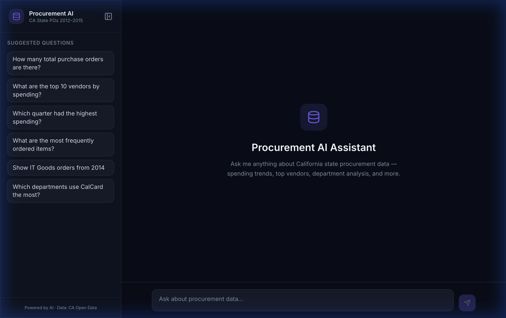
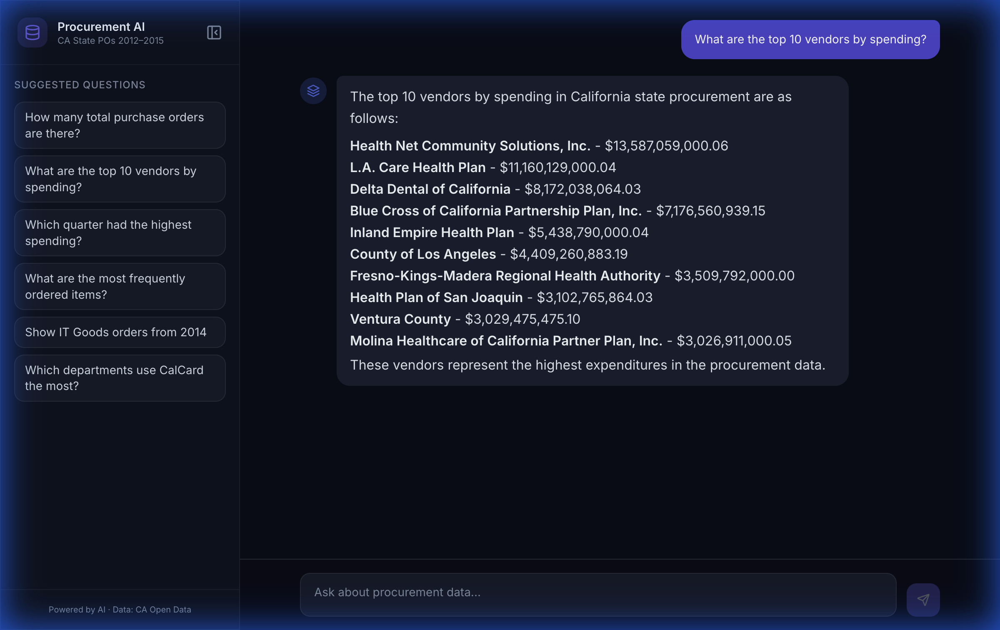

# 🏛️ Procurement AI Assistant (Penny)

An AI-powered natural language interface for exploring California state procurement data (2012–2015). Ask plain-English questions and get instant insights backed by **346,018** real purchase order records.

---

## 🎬 Demo

| Welcome Screen | Chat Response |
|:-:|:-:|
|  |  |

---

## 🏗️ Architecture

```
┌─────────────────┐       POST /chat       ┌─────────────────────────┐
│                 │ ────────────────────▸   │  FastAPI Backend (:8000) │
│  React Frontend │                        │                         │
│  (Vite + TS)    │ ◂──── { reply }        │  LLM Agent (GPT-4o-mini)│
│  localhost:8080  │                        │         │               │
└─────────────────┘                        │         ▼               │
                                           │  MongoDB (346K docs)    │
                                           └─────────────────────────┘
```

**Flow:** User question → LLM generates MongoDB query → Execute → LLM summarizes results → Response

---

## 📋 Prerequisites

| Tool | Version | Install |
|------|---------|---------|
| **Python** | ≥ 3.11 | [python.org](https://python.org) |
| **Node.js** | ≥ 18 | [nodejs.org](https://nodejs.org) |
| **MongoDB** | ≥ 6.0 | [Docker](#1-start-mongodb) or native install |
| **uv** | latest | `curl -LsSf https://astral.sh/uv/install.sh \| sh` |
| **OpenAI API Key** | — | [platform.openai.com](https://platform.openai.com) |

---

## 🚀 Quick Start

### 1. Start MongoDB

```bash
docker run -d --name mongo -p 27017:27017 mongo:7
```

### 2. Clone the repo

```bash
git clone https://github.com/Ahmed-Sadek/ai-procurement-assistant.git
cd ai-procurement-assistant
```

### 3. Set up the backend

```bash
cd backend

# Create .env file with your OpenAI key
cat > .env << EOF
OPENAI_API_KEY=sk-your-key-here
OPENAI_MODEL=gpt-4o-mini
MONGO_URI=mongodb://localhost:27017
MONGO_DB_NAME=procurement_db
EOF

# Install dependencies
uv sync

# Place the CSV data file
# Download "PURCHASE ORDER DATA EXTRACT 2012-2015_0.csv" from the CA Open Data portal
# and place it in backend/data/
mkdir -p data
# cp /path/to/your/PURCHASE\ ORDER\ DATA\ EXTRACT\ 2012-2015_0.csv data/

# Seed the database (takes ~30 seconds)
uv run python seed_db.py
```

Expected output:
```
Reading data from .../data/PURCHASE ORDER DATA EXTRACT 2012-2015_0.csv...
Found 346018 records. Inserting into MongoDB...
Successfully inserted 346018 records.
Created indexes on key fields.
```

### 4. Start the backend

```bash
uv run python main.py
```

The API server starts at **http://localhost:8000**

Verify it's running:
```bash
curl http://localhost:8000/health
# {"status":"ok"}
```

### 5. Set up and start the frontend

Open a **new terminal**:

```bash
cd frontend
npm install
npm run dev
```

The frontend starts at **http://localhost:8080**

### 6. Open the app

Visit **http://localhost:8080** in your browser and start asking questions!

---

## 💬 Example Questions

| Question | What it does |
|----------|-------------|
| How many total purchase orders are there? | Counts all 346K records |
| What are the top 10 vendors by spending? | Aggregates by supplier, sums Total Price |
| Which quarter had the highest spending? | Uses pre-computed Quarter field |
| What are the most frequently ordered items? | Groups by Item Name |
| Show IT Goods orders from 2014 | Filtered find query |
| Which departments use CalCard the most? | Groups by department, filters CalCard=YES |

---

## 🧪 Running Tests

```bash
cd backend

# Run all tests (unit + integration)
uv run pytest tests/ -v

# Run only unit tests (no MongoDB required)
uv run pytest tests/test_agent.py tests/test_api.py tests/test_db.py -v

# Run only integration tests (requires seeded MongoDB)
uv run pytest tests/test_db_integration.py -v
```

**41 tests** covering:
- **Agent** (18): parsing, sanitization, truncation, retry logic
- **API** (5): endpoint validation, agent wiring
- **DB unit** (5): mocked MongoWrapper
- **DB integration** (13): real queries against seeded data

---

## 📁 Project Structure

```
ai-procurement-assistant/
├── backend/
│   ├── app/
│   │   ├── agent.py       # LLM agent: NL → MongoDB → NL
│   │   ├── config.py      # Settings (env vars via pydantic)
│   │   ├── db.py          # MongoWrapper (query + aggregation)
│   │   ├── main.py        # FastAPI app + CORS + endpoints
│   │   ├── prompts.py     # System & summarization prompts
│   │   └── schemas.py     # Pydantic request/response models
│   ├── tests/
│   │   ├── test_agent.py          # Unit: parsing, sanitization, retry
│   │   ├── test_api.py            # Unit: FastAPI endpoints
│   │   ├── test_db.py             # Unit: mocked MongoDB wrapper
│   │   └── test_db_integration.py # Integration: real data queries
│   ├── seed_db.py         # CSV → MongoDB ingestion + indexes
│   ├── main.py            # Entry point (uvicorn)
│   └── pyproject.toml     # Dependencies
├── frontend/
│   ├── src/
│   │   ├── components/    # Chat UI components
│   │   ├── lib/api.ts     # Backend API client
│   │   └── pages/         # Main chat page
│   └── package.json
└── README.md
```

---

## 🔒 Security & Guardrails

- **Query sanitization**: Blocks `$out`, `$merge`, `delete`, `drop`, `update`, `insert` operations
- **Result truncation**: Caps at 50 documents before sending to LLM
- **Retry logic**: Up to 3 attempts if LLM produces invalid JSON
- **CORS**: Configured to allow frontend requests

---

## 🛠️ API Reference

### `GET /health`
Returns `{"status": "ok"}` if the server is running.

### `POST /chat`
```json
// Request
{ "message": "What are the top 5 departments by spending?" }

// Response
{ "reply": "The top 5 departments by spending are:\n1. ..." }
```

---

## ⚙️ Environment Variables

| Variable | Default | Description |
|----------|---------|-------------|
| `OPENAI_API_KEY` | — | Your OpenAI API key (required) |
| `OPENAI_MODEL` | `gpt-4o-mini` | LLM model to use |
| `MONGO_URI` | `mongodb://localhost:27017` | MongoDB connection string |
| `MONGO_DB_NAME` | `procurement_db` | Database name |
| `VITE_API_URL` | `http://localhost:8000` | Backend URL (frontend) |

---

## 📊 Data Source

[California State Purchase Orders (2012–2015)](https://data.ca.gov/) — 346,018 records of state procurement transactions including departments, suppliers, items, and costs.

---

## 📝 License

MIT
